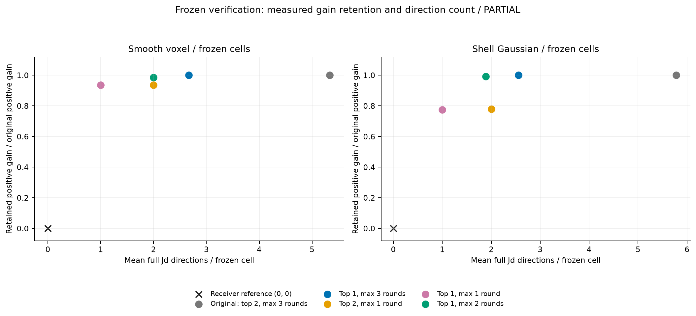
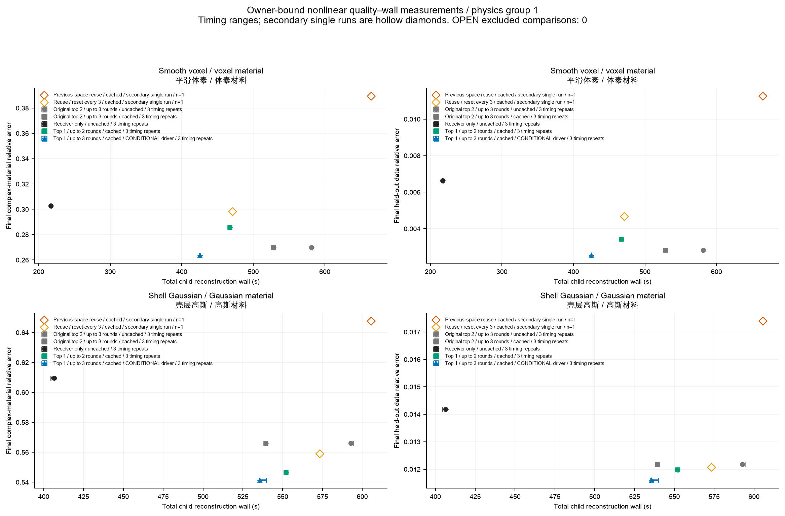

# 在材料步收益与核验费用之间选一个部署点

## 结论

**CONDITIONAL。唯一有条件推荐：每轮只核验排序第一的候选，最多接受三次交换，加精确几何基底缓存。** 每次接受后仍重新提出条件候选，所有正接受仍计算完整 Jd 并通过原在线收益门槛。它减少了约一半完整核验方向，并在两个规定对象的完整重建中保住质量。两对象相对receiver的时间比为1.958与1.318，尚未同时达到1.3。

这里的“保留收益”指固定线性化中完整GN二次差距的下降。它与最终材料误差是两个坐标，分别作图；计时重复也不是新对象。

## 固定状态的收益—核验方向曲线

两个对象各3个状态、k=4/8/16。收益按每对象9个单元求和后，与原策略收益总和比较。方向数包括被拒绝的finalist，不包括单独的Jx初始化；每方向有6个照明RHS。

| 路线 | 平滑收益保留 | 平滑平均Jd | 壳体收益保留 | 壳体平均Jd | 分支判断 |
|---|---:|---:|---:|---:|---|
| P0 receiver不交换 | 0% | 0 | 0% | 0 | 共同起点 |
| P1 原top-2、最多3交换 | 100% | 5.333 | 100% | 5.778 | 原策略 |
| P3 top-1、最多3交换 | 100.016% | 2.667 | 100.028% | 2.556 | CONDITIONAL，方向超过2 |
| P4 top-2、最多1交换 | 93.747% | 2.000 | 77.942% | 2.000 | 壳体未达收益门槛 |
| P5 top-1、最多1交换 | 93.666% | 1.000 | 77.454% | 1.000 | 壳体未达收益门槛 |
| top-1、最多2交换 | 98.607% | 2.000 | 99.257% | 1.889 | Gate A GO，随后非线性质量失败 |

超过100%的聚合来自条件路径改变；它不是一个排序保证。壳体late/k=16仍存在第一名负、第二名正的真实例外，top-1可丢掉这个局部机会。保留完整逐单元数据，避免约99%的聚合掩盖不动作或低保留单元。

## 完整重建的时间—质量曲线

固定k=8、18次更新、无噪声、同初始化、prior、LM、约束投影和Armijo。下表时间为三次轮换顺序试验的child-wall中位数，括号内为最小—最大值。始终沿用和每三次重置是一次补充试验，单独标n=1。complex材料误差与留出测量误差均越小越好。

| 对象/路线 | 时间/s | 材料误差 | 留出误差 | Jd方向 | 总切向RHS |
|---|---:|---:|---:|---:|---:|
| 平滑voxel：receiver | 217.053 (216.891–218.071) | 0.302660 | 0.00663726 | 0 | 0 |
| 原交换，未缓存 | 581.346 (580.577–582.106) | 0.269856 | 0.00283650 | 100 | 708 |
| 原交换，仅缓存 | 528.147 (528.132–529.034) | 0.269856 | 0.00283650 | 100 | 708 |
| top-1、最多2交换、缓存 | 466.857 (466.056–467.907) | 0.285904 | 0.00343622 | 36 | 324 |
| **top-1、最多3交换、缓存** | **425.031 (424.896–425.469)** | **0.263687** | **0.00254582** | **50** | **408** |
| 一直沿用空间，n=1 | 664.900 | 0.389311 | 0.01125454 | 58 | 456 |
| 每三次重置，n=1 | 471.166 | 0.298203 | 0.00466477 | 70 | 528 |
| 壳体Gaussian：receiver | 406.477 (404.412–406.792) | 0.609640 | 0.01418998 | 0 | 0 |
| 原交换，未缓存 | 592.709 (592.504–594.423) | 0.565989 | 0.01217928 | 106 | 744 |
| 原交换，仅缓存 | 539.256 (539.062–540.117) | 0.565989 | 0.01217928 | 106 | 744 |
| top-1、最多2交换、缓存 | 551.927 (551.738–552.340) | 0.546582 | 0.01198191 | 36 | 324 |
| **top-1、最多3交换、缓存** | **535.598 (535.043–539.853)** | **0.541335** | **0.01160040** | **52** | **420** |
| 一直沿用空间，n=1 | 605.606 | 0.647620 | 0.01739562 | 64 | 492 |
| 每三次重置，n=1 | 573.347 | 0.558965 | 0.01206970 | 78 | 576 |

相同颜色对应同一对象，主试验显示三次时间范围，沿用空间路线只给一次测量。top-1/3来自单列配置的补充执行，源码/物理合同/输入已经逐项核对；它不是与主24个任务同批轮换的独立holdout。所有组都完成18次更新，较低时间没有来自提前终止。

## P0–P9的完整去向

| 编号 | 内容 | 测得结果/未运行原因 |
|---|---|---|
| P0 | receiver | 完整配对基线 |
| P1 | 原verified exchange | 保留原科学与新匹配计时 |
| P2 | 解析上界提前拒绝 | 保存样本少量可拒；真正g_F(x)需额外伴随，部署节省0，NO-GO |
| P3 | 一名finalist | 冻结收益保留；与缓存结合为推荐路线 |
| P4 | 最多一次交换 | 壳体收益损失约22%，NO-GO |
| P5 | 一名finalist×一次交换 | 壳体收益损失约23%，NO-GO |
| P6 | 沿用已核验电流空间 | 两固定复用规则均未保住统一质量，NO-GO |
| P7 | 位移秩压缩 | 保存矩阵基本满秩，未来位移又不可免费预取，未部署 |
| P8 | 最佳组合 | **top-1/3+几何缓存，CONDITIONAL**；top-1/2不是最终推荐 |
| P9 | anchor误差半径拒绝 | 固定经验半径在已存完整轨迹上拒绝0个，未部署；不做cheap accept |

未运行分支没有虚构零时间、零误差或Pareto点。P2/P7/P9的诊断费用仍在预算账本，不能当作部署收益。完整RHS、LU、回退与接受次数图见两个对象的`owner_physical_counts_*_physics_01`文件。

## 推荐点为什么不是方向数最少的点？

最多两次交换在冻结状态中保住约99%的聚合收益，但平滑重建材料误差比原方法高5.95%、留出误差高21.14%，超出预先固定的1%质量容差。最多三次交换在两个对象上都满足该质量门槛；这是选择它而不是最少方向路线的依据。

减少Jd也不等于同比例减少整条重建时间。原定向求解本来共享LU且已真正block化；几何bank反复获取和完整forward/line search占了更多时间。推荐策略在平滑对象减少的约100秒线搜索费用来自改变后的实际轨迹，不是一个可普遍兑现的Jd核函数加速。

数据依据：`analysis/owner_closeout_v1/SUMMARY.json/.csv`，完整`analysis/owner_nonlinear_v2/runs.json`及原始数组审计；冻结数据为`analysis/derived_v3/frozen_object_policy.*`。三次计时重复的范围是机器计时离散程度，不是对象泛化置信区间。
