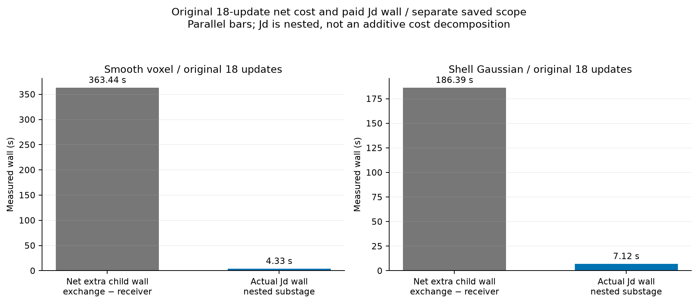

CONDITIONAL

# A17定向核验效率收口：省掉重复构建，保留第三次交换

## 得到了什么

**唯一有条件推荐的efficient deployment policy：每轮只完整核验排序第一的候选，最多接受三次交换，使用精确geometry-only cache。** 所有接受仍付费计算当前状态的完整Jd，沿用原在线有限收益门槛；第一名不通过就停止该路径。每次接受后重新计算条件提案。每个外迭代仍从receiver基底开始，不复用旧材料状态的Jd，也不采用经验半径的直接接受。

在两个规定对象、相同k=8和18次受约束更新下，该路线把完整核验方向从100→50、106→52；总切向RHS从708→408、744→420。三次计时中位数从581.346→425.031秒、592.709→535.598秒，分别降低**26.89%和9.64%**。最终complex材料误差与留出测量误差均低于原A17。

代价仍高于unchanged receiver：时间比为**1.958和1.318**，平均每外迭代核验**2.778和2.889**个方向。两个规定目标“平均≤2方向”和“整体时间比≤1.3”没有一起实现，因此最终是CONDITIONAL。这是一项有证据的部署优化，不是更快成像的普遍结论。

k为所有照明共享的实际复电流列数（complex current dimension）；k=8可对应16个实电流坐标，但不增加复列数。材料更新坐标始终为实数、保留原物理范数；Gaussian和voxel的参数维数不同。

## 一个改变优化重点的发现

最初的成本假设是“反复完整Jd核验主导额外费用”。实测不支持它。原18次更新中，finalist Jd分别仅占4.330秒和7.117秒，是exchange相对receiver净增量的**1.19%与3.82%**。原后端已经共享CUDA complex128 LU，并把候选×六照明打包为真正多右端求解（multi-RHS）。

反复构建anchor、候选bank和工作空间约需200秒，才是主要直接增量。缓存几何相关V/meta在数值不变的条件下将完整轨迹时间降低约9%；六组缓存/不缓存相关数组的**1308项比较逐字节相同**。不随材料改变的几何信息值得复用，依赖当前材料的L、注入B、Jd和条件评分仍重新计算。

平滑对象推荐策略相对“仅缓存”又省约103秒，其中约100秒对应较少的完整forward/Armijo工作，LU从65降到35。壳体LU仍为92，主要收益就是几何缓存。改变交换路径也改变了非线性轨迹，所以这部分时间下降是实测后果，不能承诺对其他对象重复发生。测得总时间中还有未归属的区间；不能把它全部称为传输、同步或存档开销。

## 三个门槛分别怎样判

| 检查 | top-1、最多2交换、缓存 | 推荐top-1、最多3交换、缓存 |
|---|---|---|
| 固定状态Gate A | GO：平均2.000/1.889方向；收益保留98.607%/99.257% | CONDITIONAL：2.667/2.556方向；保留100.016%/100.028% |
| 重建质量Gate B | FAIL：平滑材料+5.95%，留出+21.14% | 两对象通过预锁1%质量容差，误差均更低 |
| 运行时间Gate C | 2.151/1.358，未达1.3 | 1.958/1.318，仍未同时达1.3 |

固定状态收益是R_GN下降，不能代替最终材料误差。这里18个固定单元来自两个对象，不是18个独立场景。推荐路线的三次完整重建是在主试验发现top-1/2质量问题后单独准入的预声明补充分支；它保留CONDITIONAL身份，不称新的holdout。

## 完整质量和费用

| 指标 | 平滑voxel：原→推荐 | 壳体Gaussian：原→推荐 |
|---|---:|---:|
| child-wall中位数/s | 581.346→425.031 | 592.709→535.598 |
| 推荐时间最小—最大/s | 424.896–425.469 | 535.043–539.853 |
| 最终complex材料误差 | 0.269856→0.263687 | 0.565989→0.541335 |
| 留出测量误差 | 0.00283650→0.00254582 | 0.01217928→0.01160040 |
| 完整Jd方向 | 100→50 | 106→52 |
| 完整切向RHS（含Jx） | 708→408 | 744→420 |
| 完整伴随RHS | 108→108 | 108→108 |
| 完整forward RHS | 390→210 | 552→552 |
| 完整LU次数 | 65→35 | 92→92 |
| full-gradient fallback次数 | 4→1 | 7→8 |

全部34条新轨迹完成18次更新，**612个接受后的材料检查点满足固定约束**，最终材料等于最后安全检查点。相同constraints/Armijo、k=8和输入合同逐项核对；34组最终场与材料为complex128。检查点可行和数组一致性不能代替连续Maxwell精度认证。完整GN最优步没有在每一个变化中的非线性状态形成，因而逐状态非线性R_GN是NOT_MEASURED。

三次重复仅提供计时中位数和范围；它们不增加两个对象的科学样本量。child wall包括其计时范围内计算、存档和终点指标，开始前导入/守卫等由external occupation另记。所有拒绝、回退、诊断和失败计费，不能把短时warm selection称为整条重建耗时。

## 对十二个问题的明确回答

1. **时间增量在哪里？** 主要在反复bank/anchor/工作空间构建，以及策略改变引起的完整forward/line search费用；仍有未归属区间。
2. **Jd占多少增量？** 原平滑1.19%、壳体3.82%的净增量。方向多，但共享LU后的单次作用便宜。
3. **解析上界能提前拒绝多少？** 保存数据的精确g_F(x)回看可拒平滑0/100、壳体3/106；可选近接触5/106，假拒绝0。部署时g_F(x)并非共同免费量，实际节省0，NO-GO。
4. **位移实际低秩吗？** 保存同状态矩阵多数p=6、rank=6；两个middle/k8均6/6。不同状态J变化，跨状态秩不能授权复用旧Jd。未部署压缩。
5. **block还省多少？** 原实现已经真正block。新控制中block约0.084秒、两个单方向约0.076秒，同12RHS、无新LU，没有新的速度优势。
6. **top-2必要吗？** 对两个pilot聚合，top-1保留主要收益；壳体late/k16有第一名负、第二名正的例外。不能说第二名永远无用。
7. **第三次必要吗？** 两次保住约99%冻结聚合，却没保住平滑非线性质量；三次在已测重建中满足统一质量门槛，故保留。
8. **上一电流空间可沿用吗？** always-reuse两对象都更差；period-3仍损失平滑质量。两固定规则NO-GO，未事后拟合drift阈值。
9. **anchor足够做廉价triage吗？** 固定经验半径在306个保存样本上覆盖，但完整非线性核验提前拒绝0个。仅一个开发冻结单元有反事实6RHS节省；实际0，不部署。
10. **verification ROM值得吗？** 本任务NOT_RUN。原Jd只占几秒、位移基本满秩、经验triage无收益，新的ROM构建很难击中主费用；已完成方向数近半减少，不再扩成另一条ROM研究。
11. **无NN最低时间比？** 同时保住两对象质量的统一推荐为1.958/1.318。更轻policy的个别时间低不能越过质量门槛。
12. **剩余成本交给A18吗？** 已交付(J_F−J_A)d成对数据和在线特征。学习这个physics defect可以探索减少定向回退，但在当前已共享LU的后端，消除Jd本身仅省少量时间，无法自动消除约150秒workspace和line-search费用。

## 费用、终态与来源

42个新数值attempt均配对闭合，其中一次profile启动失败1.906秒保留；没有未知或未配对attempt。新占用**17,456.340秒（4小时50分56秒）**；旧授权累计carry19,962.060秒只加一次，最终**37,418.400秒（10小时23分38秒）**，低于累计12小时上限，余5,781.600秒不继续使用。

最终不可变快照SHA256为`a706587bf73636c97a3166848388391c85c2df2248ea5f417108d7bc7b8e5e3b`。它绑定收集前后的源码、配置、输入与账本；没有活动数值进程或锁。9,549个文件本地同步，504个巨大workspace仅保留哈希。旧17个项目文件与42个vendor依赖也只提供来源身份。这是**evidence/reanalysis package，不是self-contained GPU replay**。

## 部署建议与论文处理

部署使用统一top-1/3+精确几何缓存；不按对象家族事后挑不同策略。若部署目标必须接近receiver费用，当前证据仍不足以批准这一目标。缓存本身的数值等价证据最强；减少候选检查的质量证据限于两个无噪声对象、k=8完整轨迹及18个冻结单元。

原A17的35/36、locked holdout、噪声、candidate coverage、information与pair witness、finite gain均保持原档案。本任务作为效率后续证据，不覆盖旧策略结果，不新增selector或训练网络，也不把工程优化写成新的理论贡献。原论文不在这里全面重构；可把上述明确的耗时与边界纳入部署讨论。

阅读入口：`A17_EFFICIENCY_PARETO.md`给完整曲线，`A17_EFFICIENCY_PROFILE.md`给不重复累加的阶段计时，`A17_EFFICIENCY_COST_FINAL.md`给所有费用，`A17_EFFICIENCY_REPRODUCTION.md`给版本和重画方法，`A17_EFFICIENCY_CLAIM_LEDGER.md`给允许使用的科学表述。
